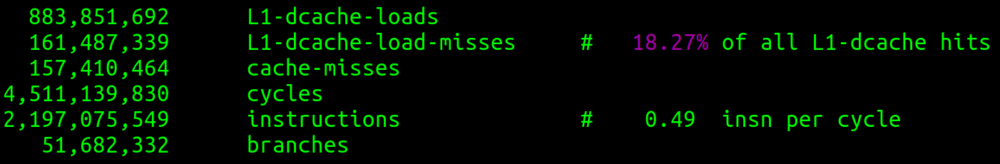
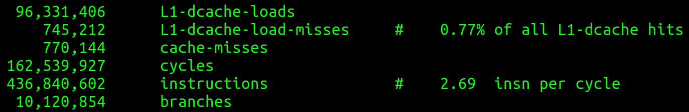

# Mean Blur Optimization

This is a project to optimize an image blurring algorithm. Each subsequent mask version in mask.c attempts to improve on the previous version. 
---
## Successful strategies pursued are as follows:

* reduction of cache misses by changing the pattern of access to the images
* eliminating unnecessary work and writing to output image the minimum necessary amount of times
* reduction of branch prediction miss through eliminating most if statements, as well as less instructions in the pipeline overall. Instead, explicitly calculating the top and bottom rows, as well as the first and last pixel of each row, in order to avoid boundary checks at each iteration which is unnecessary for the majority of the image.
* multithreading the workload

mask14(), mask15() in mask.c are optimized single threaded implementations

mask16() is the optimized multithreaded implemention

---
## Strategies that did not work include:
* reduction of branch prediction miss through manual gcc compiler hints __builtin_expect(), probably because the CPU hardware branch predictor is much better at this than I am
* reduction of cache misses with manual prefetch through gcc __builtin_prefetch(), again, probably because the CPU hardware prefetch already does this

---
## Results:
Output from perf stat, including cache performance and total instructions and cycles taken. These tests were done on a stripped down version of the main function that only runs the respective mask functions, excluding reading/writing to output files, etc.

Hardware used: Intel i7 9700k @ 4.6 GHz boost clock. RAM @ 3200 MHz, CL16.

Initial results from unoptimized mask0:

Results from best optimized single threaded mask14:

From above, the improvement from the base algorithm is as follows:

* 99.6% reduction in total L1 cache misses.
* 96.4% reduction in total CPU cycles.
* 80.1% reduction in total instructions.
* increase from 0.49 to 2.69 instructions per cycle.

Mask16 (multithreaded) follows the same trend, albeit slightly worse cache metrics, but naturally with a lower total time.

<h5>Total time for entire algorithm (ie output from running ./timemask)</h5>

| Mask version       | time (usec) | time ratio to base |
|--------------------|-------------|--------------------|
| 0                  | 1278281     | 1                  |
| 14 (single thread) | 25659       | 0.016484           |
| 16 (multithread)   | 3026        | 0.002981           |

times for each other versions are recorded at the start of each function in mask.c

---
## TODO:
* another image access pattern: working down the image going through cache line size number of bytes worth of pixels at a time.
* CUDA! I need more threads! Though my initial thoughts are that it's not worth it unless it's a very computationally intensive algorithm on a large image; the benefits of all the extra threads must outweigh the cost of cudaMemcpy() from system memory to VRAM and back.

---
## To run this program:

1. run **make** on a pthread and gcc supported system
2. ./timemask <src_image.pgm> <number_of_trials> <output_image.pgm>
